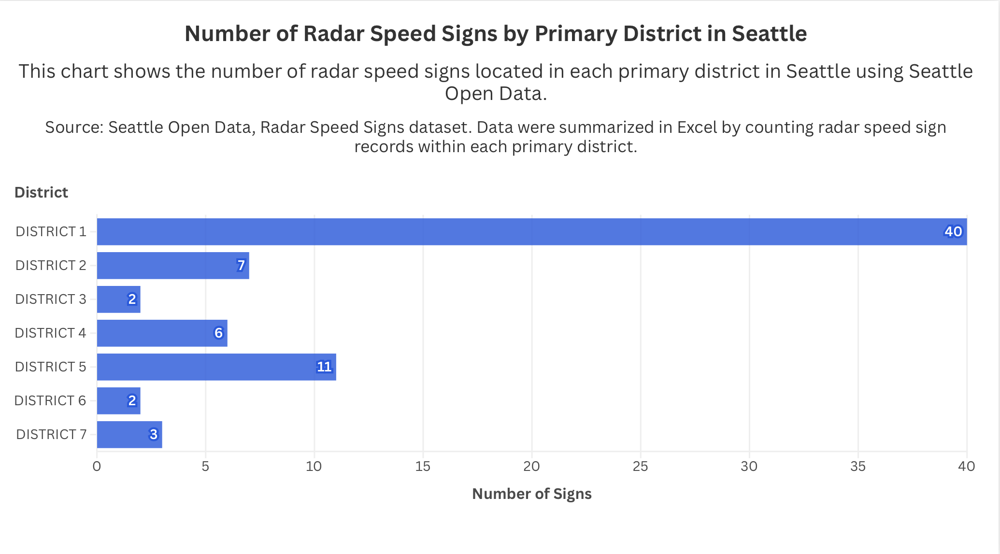

# Flourish 1

## Overview
This visualization shows the number of radar speed signs in Seattle by primary district. I used the Radar Speed Signs dataset from Seattle Open Data, cleaned and summarized the data in Excel, and created the chart in Flourish.

## Data Source
Source: Seattle Open Data  
Dataset: Radar Speed Signs  
Link: https://data.seattle.gov/dataset/Radar-Speed-Signs/3r3n-4vz3/about_data

## About the Visualization
This bar chart represents the number of radar speed signs located in each primary district in Seattle. I chose a bar chart because it makes the differences between districts easy to compare. The data was summarized by counting the number of radar speed sign records in each primary district before uploading the cleaned file into Flourish.

## Image of Visualization

## Published Flourish Link
[View the published visualization here](https://app.flourish.studio/visualisation/28547389/edit)

## Notes
The data was first downloaded from Seattle Open Data, then cleaned and summarized in Excel before being uploaded into Flourish.
