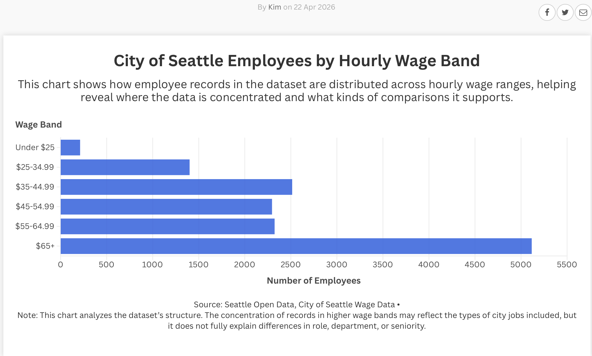

# Flourish 2

## Description
This visualization uses the Seattle Open Data City of Seattle Wage Data dataset. Instead of only showing a story about wages, I used the chart to analyze the structure of the dataset itself. The visualization groups employee records into hourly wage bands to show where the data is concentrated and what kinds of comparisons the dataset supports.

## What the visualization shows
The chart shows the number of City of Seattle employee records in each hourly wage band. This makes it easier to see that the dataset is not evenly distributed across wage levels. The largest number of records appears in the higher wage bands, especially the $65+ category, while very few records appear in the Under $25 category.

## Why this is analytical
This chart is analytical because it focuses on the dataset itself rather than only the topic of wages. By showing the distribution of records across wage ranges, it reveals patterns in the data and raises questions about the composition of city jobs included in the dataset. It also shows a limit of the data, since differences in wage bands do not fully explain role, department, seniority, or work status.

## Data source
Seattle Open Data – City of Seattle Wage Data  
[Paste your dataset link here]

## Image of Visualization

## Flourish Published Link
[https://public.flourish.studio/visualisation/28654030/]

## Notes
This visualization is useful for understanding the structure of the dataset, especially where employee records are concentrated across hourly wage bands. However, it should be interpreted carefully because the chart does not show the full context behind wage differences.
