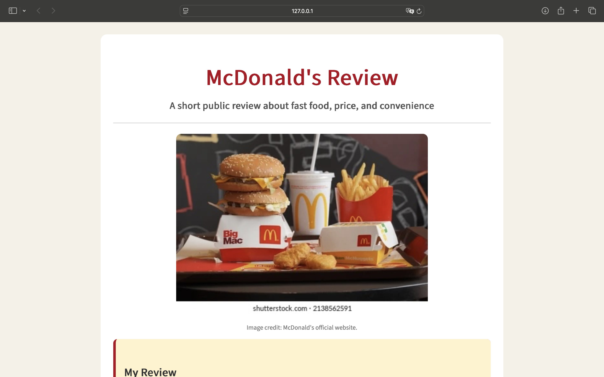

# Intro to HTML/CSS Assignment

For this assignment, I created a short public-facing review of McDonald's. My review talks about fast food, convenience, price, and how people choose food based on time and money.

I used HTML to organize the page with headings, paragraphs, a list, a link, and an image. I used CSS to change the font, colors, spacing, image layout, and page organization. I also included one HTML comment and one CSS comment to show my understanding of the code structure.

## Screenshot

## Image Credit

Image credit: McDonald's official website.

## Link

The page includes a link to the official McDonald's website:
https://www.mcdonalds.com/us/en-us.html
