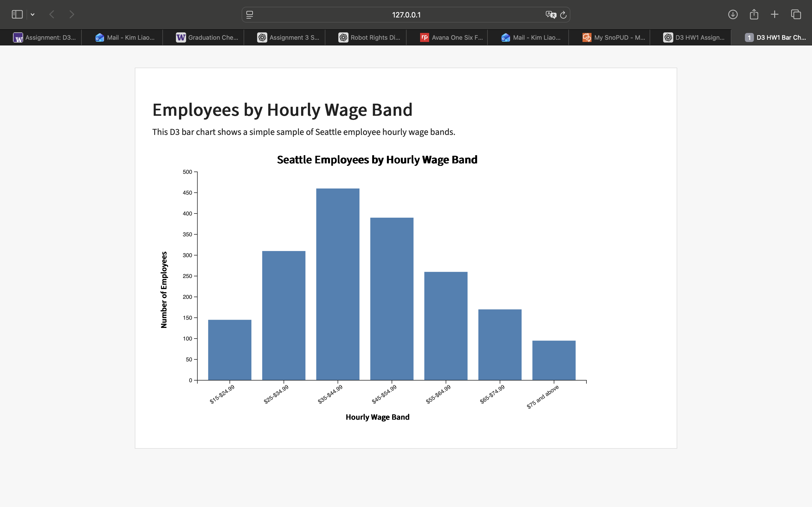

# D3 HW1: Employees by Hourly Wage Band

## Project Description

This project is a basic D3 bar chart showing a simple sample of Seattle employees grouped by hourly wage band. The chart uses an external CSV file, D3 scales, axes, and SVG rectangles to build the visualization.

## Files Included

- `index.html` loads the webpage, CSS file, D3 library, and JavaScript file.
- `main.js` loads the CSV data and creates the D3 bar chart.
- `style.css` styles the webpage and chart.
- `data.csv` contains the wage band and employee count data.
- `output-screenshot.png` shows the final chart output.

## Data Source

The dataset is based on the City of Seattle Wage Data, specifically employees by hourly wage band data from Seattle Open Data.

Source: City of Seattle Open Data, City of Seattle Wage Data  
https://data.seattle.gov/City-Administration/City-of-Seattle-Wage-Data/2khk-5ukd/about_data

## Chart Description

The x-axis shows hourly wage bands, and the y-axis shows the number of employees in each wage band. The bar height represents how many employees fall into each wage group. This chart is useful for quickly comparing which wage bands have the most employees.

## Screenshot

